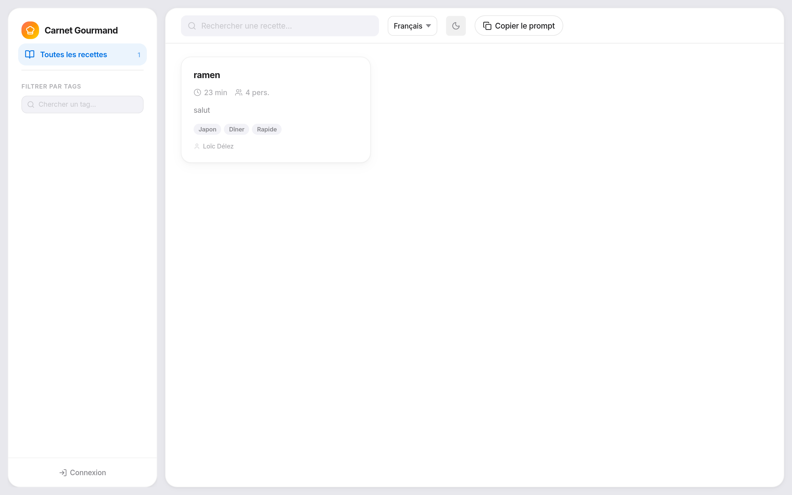
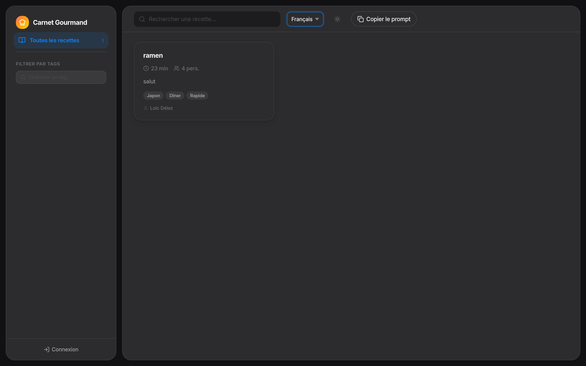
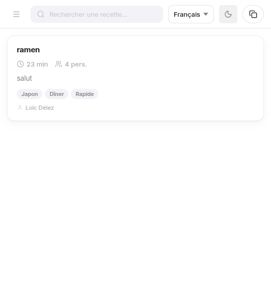
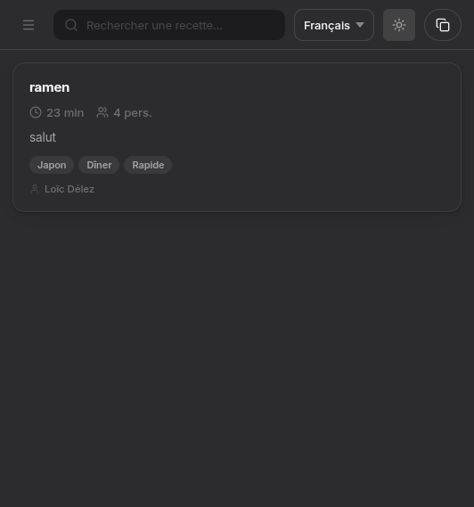

# Carnet Gourmand

Application web de gestion de recettes de cuisine avec authentification, stockage cloud et interface traduite en 5 langues.

## Apercu

### Desktop

| Mode clair | Mode sombre |
|:---:|:---:|
|  |  |

### Mobile

| Mode clair | Mode sombre |
|:---:|:---:|
|  |  |

## Fonctionnalites

- **Recettes en Markdown** — Editeur avec apercu en temps reel, export Markdown et PDF
- **Authentification** — Email/mot de passe et Google Sign-In via Firebase Auth
- **Stockage cloud** — Recettes synchronisees en temps reel avec Firestore
- **5 langues** — Francais, English, Deutsch, Italiano, Espanol (detection automatique + persistance)
- **Langue par recette** — Chaque recette peut avoir sa propre langue, avec badge visuel
- **Tags & filtres** — Systeme de tags avec recherche, filtrage multi-tags (logique AND)
- **Theme clair/sombre** — Bascule manuelle, persistee en localStorage
- **Prompt IA** — Copier un prompt pre-formate pour generer des recettes avec une IA
- **Responsive** — Desktop, tablette et mobile
- **Docker** — Image legere (Nginx Alpine) prete au deploiement

## Stack technique

| Composant | Technologie |
|-----------|-------------|
| Frontend | Vite, JavaScript vanilla (ES modules) |
| Style | CSS custom (design systeme Apple-like) |
| Auth | Firebase Authentication |
| Base de donnees | Cloud Firestore |
| Markdown | marked + DOMPurify |
| Export PDF | html2pdf.js |
| Icones | Lucide |
| Deploiement | Docker (Nginx Alpine) |

## Installation locale

```bash
# Cloner le repo
git clone https://github.com/Louisdelez/RecetteCuisine.git
cd RecetteCuisine

# Installer les dependances
npm install

# Configurer Firebase — creer un fichier .env a la racine
cat <<EOF > .env
VITE_FIREBASE_API_KEY=your_api_key
VITE_FIREBASE_AUTH_DOMAIN=your_project.firebaseapp.com
VITE_FIREBASE_PROJECT_ID=your_project_id
VITE_FIREBASE_STORAGE_BUCKET=your_project.firebasestorage.app
VITE_FIREBASE_MESSAGING_SENDER_ID=your_sender_id
VITE_FIREBASE_APP_ID=your_app_id
EOF

# Lancer en dev
npm run dev
```

L'app sera disponible sur `http://localhost:5173`.

## Deploiement Docker

```bash
# Build et lancement
docker compose up -d

# Rebuild apres modification
docker compose up -d --build
```

L'app sera disponible sur `http://localhost:8080`.

Pour changer le port, modifier `docker-compose.yml` :

```yaml
ports:
  - "3000:80"
```

> **Note :** Les variables Firebase sont injectees au build. Le fichier `.env` doit etre present a la racine avant de lancer `docker compose up --build`.

## Structure du projet

```
src/
  main.js              # Point d'entree, orchestration i18n + auth
  style.css            # Styles globaux (theme clair/sombre, responsive)
  modules/
    i18n.js            # Module d'internationalisation
    translations.js    # Traductions (FR, EN, DE, IT, ES)
    shell.js           # Template HTML principal
    render.js          # Rendu dynamique (grille, panel, sidebar)
    events.js          # Gestionnaires d'evenements
    store.js           # Couche Firestore (CRUD recettes)
    auth.js            # Authentification Firebase
    firebase.js        # Config Firebase
    download.js        # Export Markdown / PDF
    theme.js           # Theme clair/sombre
    icons.js           # Icones Lucide (SVG inline)
    state.js           # Etat UI (filtres, recherche, selection)
    utils.js           # Utilitaires (escape HTML, normalisation)
```

## Licence

[MIT](LICENSE)
